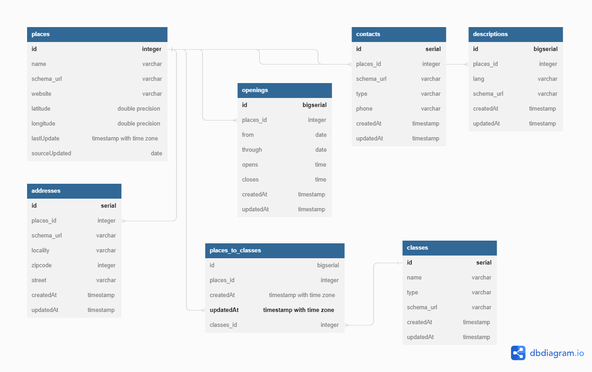

# Bienvenue sur %product%

<!--Writerside adds this topic when you create a new documentation project.
You can use it as a sandbox to play with Writerside features, and remove it from the TOC when you don't need it anymore.-->

## Récolte des données
[DATAtourisme](https://www.datatourisme.gouv.fr/) est une plateforme qui permet de récolter des données touristiques de différentes sources. 
* Nous avons choisi de travailler sur les données de la ville de Paris et de ses environs. 
* Nous avons donc récupéré les données de la zone sur le site de DATAtourisme. 
* Nous avons récupéré les données en format JSON, CSV et turtle.

[Data Discovery](Datatourisme-Ontology-Overview.md)

[DB Diagramme](https://dbdiagram.io/d/64887fb9722eb77494e43a40)

## Consommation de la donnée 
Appliquer le clustering pour pouvoir faire des trajets dans les clusters, le but ce serait d’arriver à avoir un trajet, ensuite il faut visualiser un trajet via Dash. 

Ils pourront récupérer le travail d’un groupe précédent pour la partie clustering. 

## Mise en production
Ils pourront dès lors coupler leur dashboard avec une API pour pouvoir utiliser la base de données Neo4j. 

Il faudra aussi utiliser Docker pour containeriser tous les micro services

## Automatisation du flux de la donnée 
ÉTAPE FACULTATIVE

Les activités sont actualisées, c’est pourquoi il faut scraper de manière régulière pour avoir une application à jour et utile.

